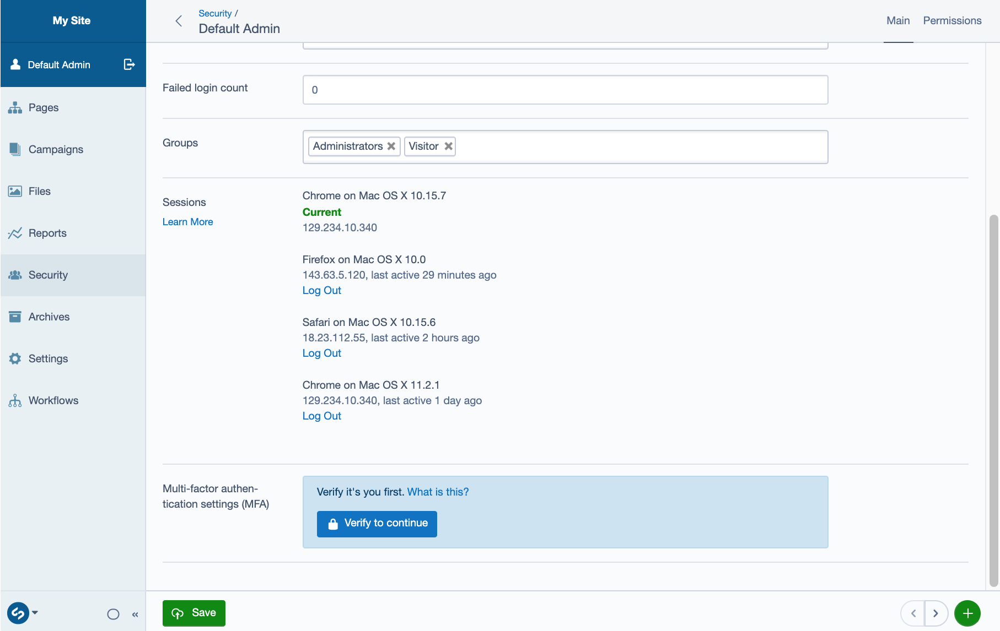

# Silverstripe CMS Session Manager

Allow users to manage and revoke access to multiple login sessions across devices.

[](https://travis-ci.com/silverstripe/silverstripe-session-manager)
[](https://scrutinizer-ci.com/g/silverstripe/silverstripe-session-manager)
[](https://codecov.io/gh/silverstripe/silverstripe-session-manager)
[](https://packagist.org/packages/silverstripe/session-manager)
[](LICENSE)



## Developer Details

The module introduces a new database record type: `LoginSession`.
On first login, it creates a new record of this type, recording the IP and User-Agent,
and associates it with the user (via `LogInAuthenticationHandler`).
The record identifier is stored in the PHP session, so it can be retrieved on subsequent requests.

On each request, a middleware (`LoginSessionMiddleware`) checks if the current
PHP session is pointing to a valid `LoginSession` record.
If a valid record is found, it will update the `LastAccessed` date.
Otherwise, it will force a logout, destroying the PHP session.

A periodic process (`GarbageCollectionService`) cleans up expired `LoginSession` records.
Due to the way PHP sessions operate, it can not expire those sessions as well.
The PHP sessions will be invalidated on next request through `LoginSessionMiddleware`,
unless they expire independently beforehand (through PHP's own session expiry logic).

Silverstripe allows persisting login state via a "remember me" feature.
These `RememberLoginHash` records have their own expiry date.
This module associates them to `LoginSession` records,
and ensures their expiry is consistent with the new session behaviour
(see "Configuration" below for details).

The `LoginSession` tracks the IP address and user agent making the requests
in order to make different sessions easier to identify in the user interface.
It does not use changes to this metadata to invalidate sessions.

## Compatibility

The module should work independently of the storage mechanism used for PHP sessions (file-based sticky sessions, file-based sessions on a shared filesystem, [silverstripe/dynamodb](https://github.com/silverstripe/silverstripe-dynamodb), [silverstripe/hybridsessions](https://github.com/silverstripe/silverstripe-hybridsessions)).

It is also compatible with the [Silverstripe MFA module suite](https://github.com/silverstripe/silverstripe-mfa).

## Caveats

 * Every request with a logged-in user causes a database write (updating `LoginSession`), potentially affecting performance
 * Restoring a database from an older snapshot will invalidate current sessions.
 * PHP sessions can become out of sync with `LoginSession` objects. Both can exist beyond their expiry date.
   This is not an issue in practice since the association between the two is checked on each session-based request
   (through `LoginSessionMiddleware`).

## Configuration

### Logout across devices

Session-manager provides an explicit way to terminate individual sessions and their attached "remember me" tokens. So this module sets `SilverStripe\Security\RememberLoginHash.logout_across_devices` to `false`.

To restore the old behaviour with session manager installed, add the following YML config to your project:

```yml
---
Name: myproject-rememberloginhash
After:
  - '#session-manager-rememberloginhash'
---
SilverStripe\Security\RememberLoginHash:
  logout_across_devices: true
```

Read [Saved User Logins](https://docs.silverstripe.org/en/4/developer_guides/security/member/#saved-user-logins) to learn how to configure the "remember me" feature for your users.

### Session timeout

Non-persisted login sessions (those where the user hasn’t ticked “remember me”) should expire after a period of inactivity, so that they’re removed from the list of active sessions even if the user closes their browser without completing the “log out” action. The length of time before expiry matches the `SilverStripe\Control\Session.timeout` value if one is set, otherwise falling back to a default of one hour. This default can be changed via the following config setting:

```yml
SilverStripe\SessionManager\Model\LoginSession:
  default_session_lifetime: 3600 # Default value: 1 hour in seconds
```

Note that if the user’s session expires before this timeout (e.g. a short `session.gc_maxlifetime` PHP ini setting), they **will** still be logged out. There will just be an extra session shown in the list of active sessions, even though no one can access it.

### Garbage collection

Expired sessions need to be cleaned up periodically to avoid bloating the database. There are two methods available to manage this:

#### Via `symbiote/silverstripe-queuedjobs` (recommended)
If you have the `symbiote/silverstripe-queuedjobs` module installed and configured, garbage collection will run automatically every 1 day via `GarbageCollectionJob`, and no further action is required.  This job will be automatically created if it does not exist on dev/build.

#### Via `LoginSessionGarbageCollectionTask`
Alternatively, you can create a system cron entry to run the `LoginSessionGarbageCollectionTask` directly on a regular cadence:

```
`*/5 * * * * /path/to/webroot/vendor/bin/sake dev/tasks/LoginSessionGarbageCollectionTask
```
