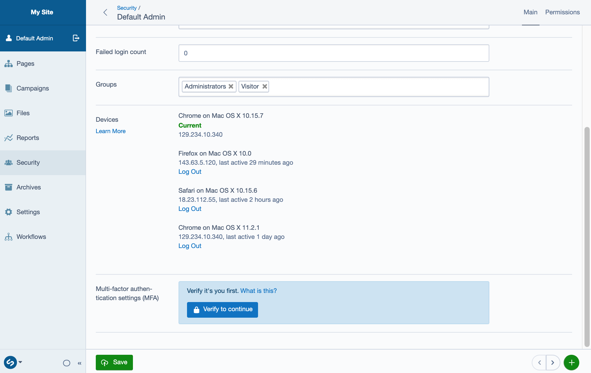

# SilverStripe Session Manager

Allow users to manage and revoke access to multiple login sessions across devices.

**This module is in development, and is not ready for use in production**



## Secure defaults

### Logout across devices

This module respects the `SilverStripe\Security\RememberLoginHash.logout_across_devices` config setting, which defaults to `true`. This means that the default behaviour is to revoke _all_ a user’s sessions when they log out.

To change this so that logging out will only revoke the session for that one device, use the following config setting:

```yml
SilverStripe\Security\RememberLoginHash:
  logout_across_devices: false
```

**Important:** do not set this value to false if users do not have access to the CMS (or a custom UI where they can revoke sessions). Doing so would make it impossible to a user to revoke a session if they suspect their device has been compromised.

### Session timeout

Non-persisted login sessions (those where the user hasn’t ticked “remember me”) should expire after a period of inactivity, so that they’re removed from the list of active sessions even if the user closes their browser without completing the “log out” action. The length of time before expiry matches the `SilverStripe\Control\Session.timeout` value if one is set, otherwise falling back to a default of one hour. This default can be changed via the following config setting:

```yml
Kinglozzer\SessionManager\Model\LoginSession:
  default_session_lifetime: 3600 # Default value: 1 hour in minutes
```

Note that if the user’s session expires before this timeout (e.g. a short `session.gc_maxlifetime` PHP ini setting), they **will** still be logged out. There will just be an extra session shown in the list of active sessions, even though no one can access it.

## To-to

- Privacy warning (storing IP/User-Agent - GDPR)
- More manual testing
- Unit test coverage
- Handle removing the “current” session better
- Garbage collection of expired, non-persisted sessions
- Garbage collection of sessions where associated RememberLoginHash has expired
