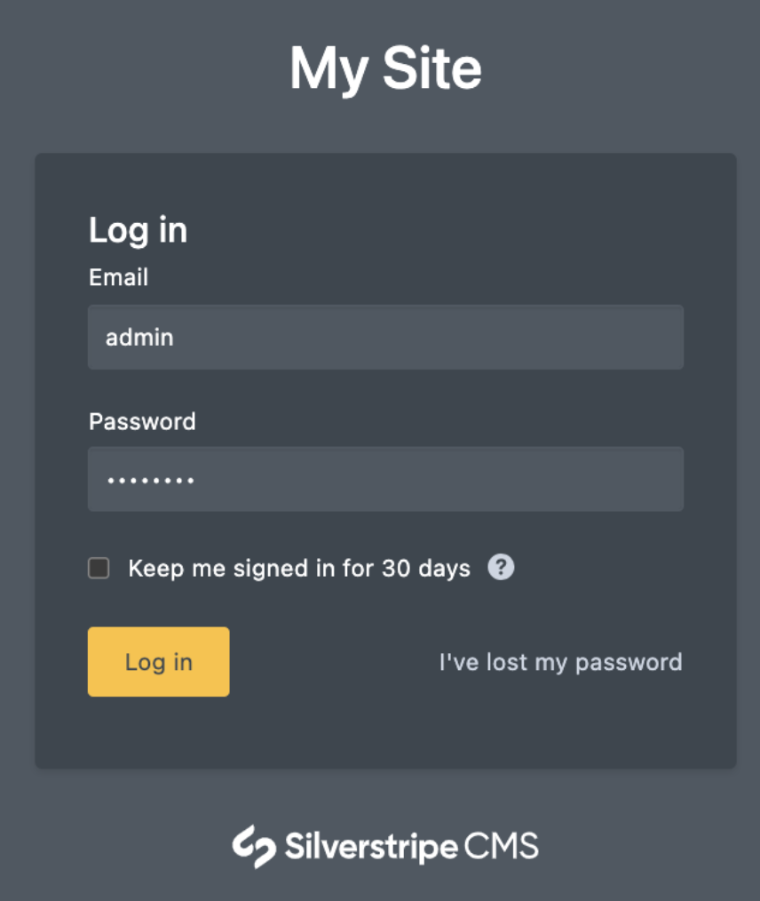
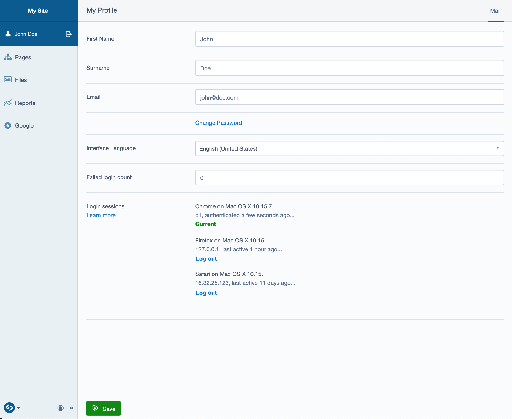
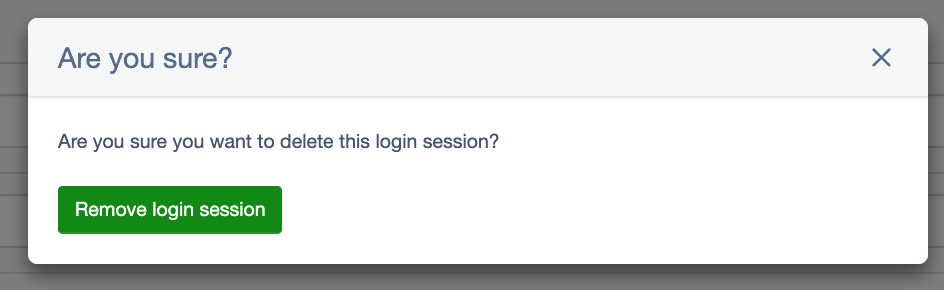

title: Session Manager
summary: Allow members to manage and revoke access to multiple login sessions across devices.

# What does the session manager module do?

The session manager module allows members to manage (see active and revoke) login sessions across devices used to access the CMS using their login credentials. Each login to a member's account is tracked and can be managed from their profile page.

# How to use it

## Getting started

Make sure you have the [SilverStripe Session Manager](https://addons.silverstripe.org/add-ons/silverstripe/session-manager) module installed

## Logging in

When logging in with "Keep me signed in for 90 days" selected, a session will remain active on that device for the full 90 days unless it is terminated prior to that allocated timeframe. Without this selected a session will only last for xyz hours.

[notice]
Note: It is advised that the "Keep me signed in" functionality is not used unless they are the only person in control of or using the device used to access the CMS.
[/notice]

## Viewing login sessions

In order to view login sessions once logged in, navigate to your profile by clicking on your name in the left hand CMS menu. Every valid and currently active login session will be listed under `Login sessions`.

There is various data associated with every login session that can be used to identify the device that is logged in:

* Browser
* Operating System
* IP Address
* Last active time
* Sign in time

[notice]
Note: Members can only view access for their own profile. Nobody else will have access to view your sessions.
[/notice]

## Revoking access

To remove access for a session associated with a device, click the `Log out` link next to the session you want to remove. This session will be immediately removed and anyone viewing the CMS using this session will need to log back in.

[notice]
Note: Members can only revoke access for their own profile. Nobody else will have access to remove your sessions.
[/notice]

## Expiry

Login sessions have an expiry of 90 days by default. After this, the session will no longer be valid and the user must log in again. Once a session has expired it will be removed from the list of active login sessions.
